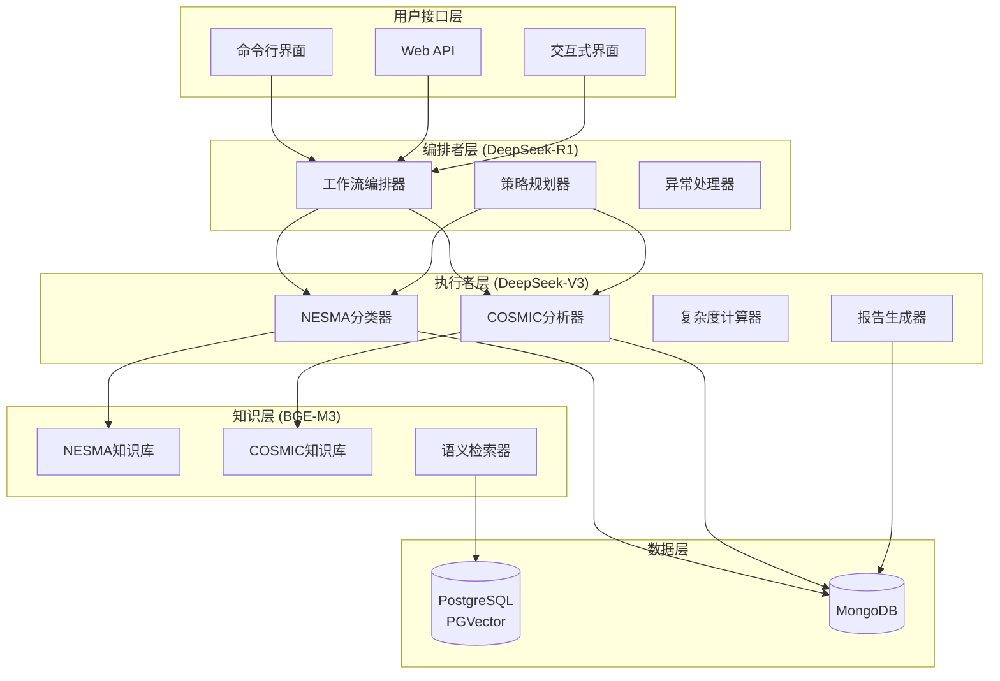

# 量子智能化功能点估算系统

[](https://www.python.org/downloads/)
[](https://opensource.org/licenses/MIT)
[](https://github.com/psf/black)

**FP-Quantum** 是一个基于AI的智能化功能点估算系统，支持NESMA和COSMIC两大国际标准，实现自动化的软件规模估算和智能质量验证。

## ✨ 核心特性

### 🎯 双标准支持
- **NESMA标准**: 支持NESMA v2.3+，包含5种功能类型(ILF/EIF/EI/EO/EQ)的自动分类和复杂度计算
- **COSMIC标准**: 支持COSMIC v4.0+，实现功能用户识别、数据移动分析和CFP计算
- **智能推荐**: 根据项目特征自动推荐最适合的估算标准

### 🤖 AI驱动的多模型协同
- **编排者智能体**: DeepSeek-R1 深度思考推理，负责复杂决策和策略规划
- **执行者智能体**: DeepSeek-V3 高效生成，负责任务执行和内容生成
- **知识检索专家**: BGE-M3 多语言向量模型，负责精准的语义检索

### 🔍 知识增强决策
- **RAG管道**: 基于LangChain的检索增强生成，结合标准文档进行智能决策
- **质量验证**: 多层次验证机制，确保估算结果的准确性和一致性
- **反馈优化**: 智能错误处理和重试机制

### 📊 企业级架构
- **工作流编排**: 基于LangGraph的状态机，支持复杂工作流程
- **多数据库协作**: PostgreSQL+PGVector向量存储 + MongoDB业务数据
- **高性能**: 分层模型架构，在保证质量的前提下显著降低成本

## 🚀 快速开始

### 环境要求

- Python 3.11+
- PostgreSQL 13+ (带PGVector扩展)
- MongoDB 5.0+
- 2GB+ 内存

### 安装

1. **克隆仓库**
```bash
git clone https://github.com/boleyn/fp-quantum.git
cd fp-quantum
```

2. **使用uv安装依赖**
```bash
# 安装uv包管理器
curl -LsSf https://astral.sh/uv/install.sh | sh

# 安装项目依赖
uv sync
```

3. **配置环境变量**
```bash
# 复制环境配置示例
cp env.example .env

# 编辑配置文件
vim .env
```

必需的环境变量：
```bash
# API密钥
DEEPSEEK_API_KEY=your_deepseek_api_key
BGE_M3_API_KEY=your_bge_m3_api_key

# 数据库配置
POSTGRES_PASSWORD=your_postgres_password
MONGODB_PASSWORD=your_mongodb_password
```

4. **初始化数据库和知识库**
```bash
# 设置数据库
uv run setup-databases.py

# 初始化知识库
uv run fp-quantum setup-kb
```

### 基本使用

1. **命令行估算**
```bash
# 查看版本信息
uv run fp-quantum version

# 运行演示
uv run fp-quantum demo

# 功能点估算
uv run fp-quantum estimate \
  --name "电商平台" \
  --desc "包含用户管理、商品管理、订单处理的电商平台" \
  --tech Java --tech React --tech MySQL \
  --domain "电商"
```

2. **启动Web服务**
```bash
# 启动API服务器
uv run fp-quantum server --host 0.0.0.0 --port 8000 --reload

# 访问API文档
open http://localhost:8000/docs
```

3. **交互式模式**
```bash
# 交互式估算
uv run fp-quantum estimate --interactive
```

## 📋 系统架构

### 核心组件



### 数据模型层次

- **通用模型**: 枚举类型、基础实体、验证结果
- **项目模型**: 项目信息、工作会话、用户档案
- **NESMA模型**: 功能分类、复杂度计算、UFP结果
- **COSMIC模型**: 功能用户、数据移动、CFP结果

## 🛠️ 开发指南

### 项目结构

```
fp-quantum/
├── agents/                     # 智能体实现
│   ├── base/                   # 基础智能体类
│   ├── orchestrator/           # 编排者逻辑
│   ├── standards/              # 标准专精智能体
│   ├── analysis/               # 分析类智能体
│   ├── knowledge/              # 知识管理智能体
│   └── output/                 # 输出处理智能体
├── graph/                      # LangGraph工作流定义
├── models/                     # 数据模型
├── knowledge_base/             # 知识库管理
│   ├── documents/              # 原始文档
│   ├── loaders/                # 文档加载器
│   ├── vector_stores/          # 向量存储
│   └── retrievers/             # 检索器
├── config/                     # 配置管理
├── api/                        # API接口
├── tests/                      # 测试代码
└── scripts/                    # 工具脚本
```

### 开发环境设置

1. **安装开发依赖**
```bash
uv sync --group dev
```

2. **代码格式化**
```bash
uv run black .
uv run isort .
```

3. **类型检查**
```bash
uv run mypy .
```

4. **运行测试**
```bash
uv run pytest
```

### 贡献指南

1. Fork项目仓库
2. 创建功能分支 (`git checkout -b feature/new-feature`)
3. 提交更改 (`git commit -am 'Add new feature'`)
4. 推送到分支 (`git push origin feature/new-feature`)
5. 创建Pull Request

## 📖 使用案例

### 案例1: NESMA标准估算

```python
from models import ProjectInfo, TechnologyStack, BusinessDomain

# 创建项目信息
project = ProjectInfo(
    name="银行核心系统",
    description="包含账户管理、交易处理、风控系统的银行核心业务系统",
    technology_stack=[TechnologyStack.JAVA, TechnologyStack.ORACLE],
    business_domain=BusinessDomain.FINANCE
)

# 运行估算（示例代码，实际需要完整实现）
# result = await run_nesma_estimation(project)
# print(f"NESMA估算结果: {result.ufp_total} UFP")
```

### 案例2: COSMIC标准估算

```python
# COSMIC估算适用于实时系统和数据密集型应用
project = ProjectInfo(
    name="物联网监控平台",
    description="实时采集和处理传感器数据的物联网监控平台",
    technology_stack=[TechnologyStack.PYTHON, TechnologyStack.MONGODB],
    business_domain=BusinessDomain.MANUFACTURING
)

# result = await run_cosmic_estimation(project)
# print(f"COSMIC估算结果: {result.cfp_total} CFP")
```

## 🔧 配置说明

### 模型配置

```yaml
llm:
  orchestrator:
    model: "deepseek-reasoner"      # DeepSeek-R1 思考模型
    temperature: 0.1
    max_tokens: 8000
  
  worker:
    model: "deepseek-chat"          # DeepSeek-V3 生成模型  
    temperature: 0.1
    max_tokens: 4000
  
  embedding:
    model: "bge-m3"                 # BGE-M3 向量模型
    dimensions: 1024
```

### 数据库配置

```yaml
database:
  postgres:
    host: "localhost"
    port: 5432
    database: "fp_quantum_vectors"
  
  mongodb:
    host: "localhost" 
    port: 27017
    database: "fp_quantum"
```

## 📊 性能指标

### 成本对比

| 配置方案 | 编排成本 | 执行成本 | 检索成本 | 总成本节省 |
|---------|----------|----------|----------|------------|
| **推荐配置** | DeepSeek-R1 (中) | DeepSeek-V3 (低) | BGE-M3 (免费) | **70%** |
| 传统配置 | GPT-4 (高) | GPT-4 (高) | OpenAI (低) | 基准 |

### 性能基准

- **估算准确率**: >90% (基于历史项目验证)
- **处理速度**: 平均3-5分钟/项目
- **并发能力**: 支持10+并发估算任务
- **可用性**: 99.5%+ (云环境部署)

## 🐛 故障排除

### 常见问题

1. **API连接失败**
   - 检查API密钥配置
   - 验证网络连接
   - 查看API配额限制

2. **数据库连接错误**
   - 确认数据库服务运行
   - 检查连接参数
   - 验证用户权限

3. **知识库初始化失败**
   - 检查文档路径
   - 确认向量存储配置
   - 查看磁盘空间

### 调试模式

```bash
# 启用调试模式
export DEBUG=true
export LOG_LEVEL=DEBUG

# 查看详细日志
uv run fp-quantum estimate --debug
```

## 📄 许可证

本项目采用 [MIT 许可证](LICENSE)。

## 🤝 支持与贡献

- **问题反馈**: [GitHub Issues](https://github.com/boleyn/fp-quantum/issues)
- **功能请求**: [GitHub Discussions](https://github.com/boleyn/fp-quantum/discussions)
- **技术支持**: genxm@vip.qq.com

## 🙏 致谢

感谢以下开源项目和技术：

- [LangChain](https://github.com/langchain-ai/langchain) - AI应用开发框架
- [LangGraph](https://github.com/langchain-ai/langgraph) - 工作流编排引擎
- [DeepSeek](https://deepseek.com/) - 高性能AI模型
- [BGE-M3](https://github.com/FlagOpen/FlagEmbedding) - 多语言向量模型
- [FastAPI](https://fastapi.tiangolo.com/) - 现代Web框架
- [PostgreSQL](https://www.postgresql.org/) & [PGVector](https://github.com/pgvector/pgvector) - 向量数据库
- [MongoDB](https://www.mongodb.com/) - 文档数据库

---

**量子智能化功能点估算系统** - 让软件估算更智能、更准确、更高效！ 🚀 